# 打印记录

## Ver1

### Model1

> 此文档中的模型均为不需要支撑及拆分操作，包含`把手`、`齿条1`

#### 打印结果

 `齿条1`

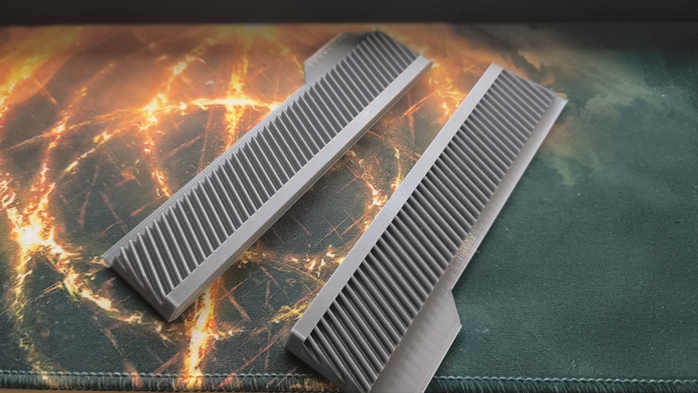

`把手`

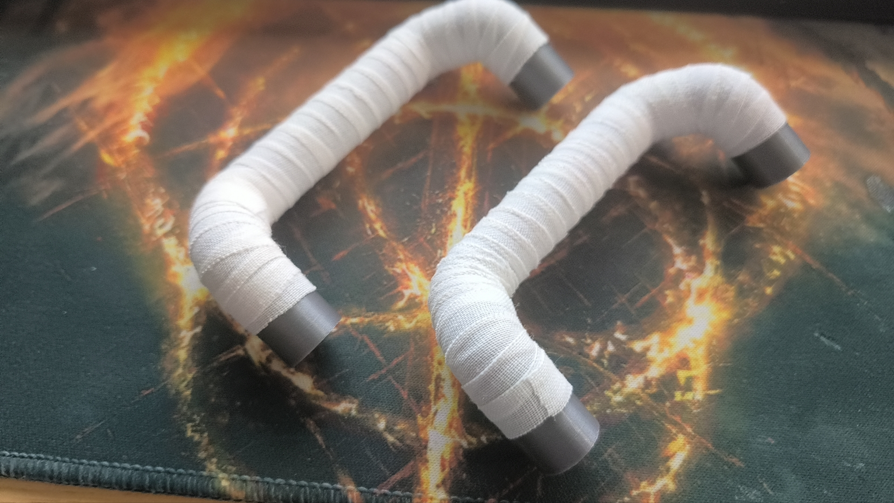

#### 存在的问题

`把手`在使用 **PLA与PETG互为支撑** 的方法时出现了分界面处层间不沾的情况导致打印失败，如下图

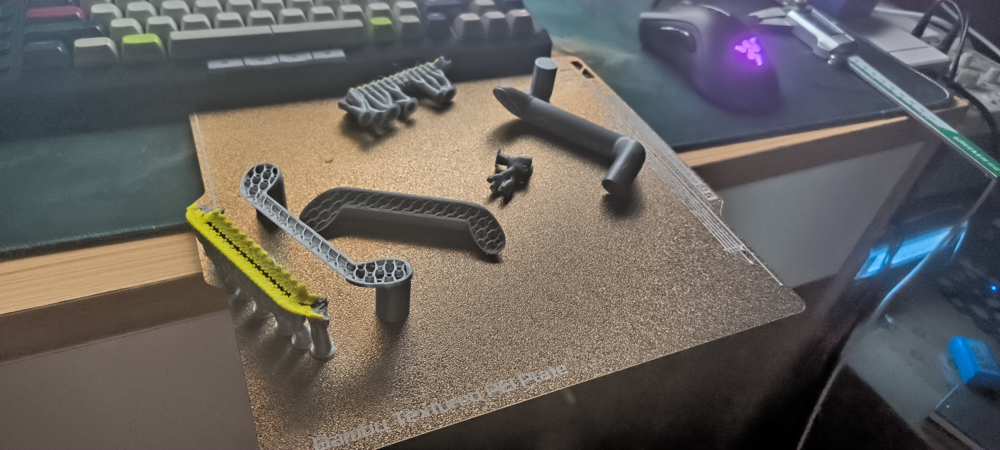

### Model2

> 此文档中的模型均为需要支撑或拆分操作，包含`齿条连接件`、`电池仓正极门`

#### 打印结果

`齿条连接件`

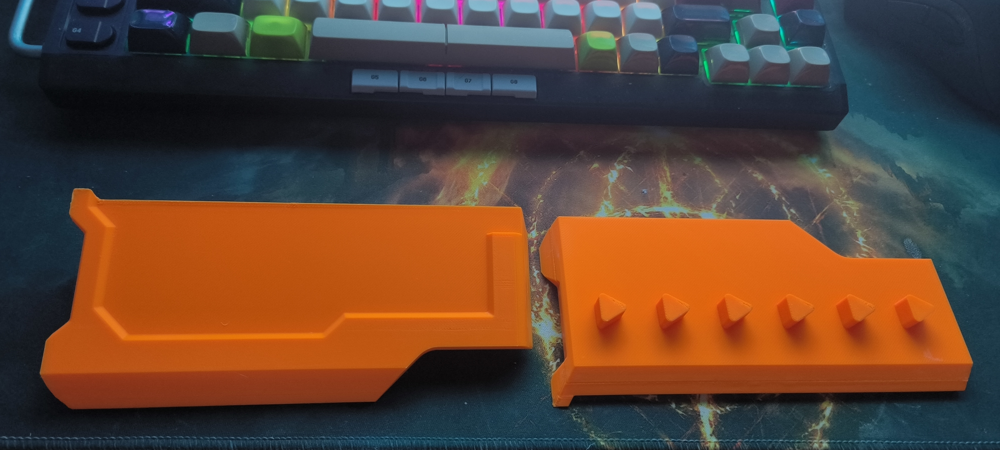

`电池仓正极门`

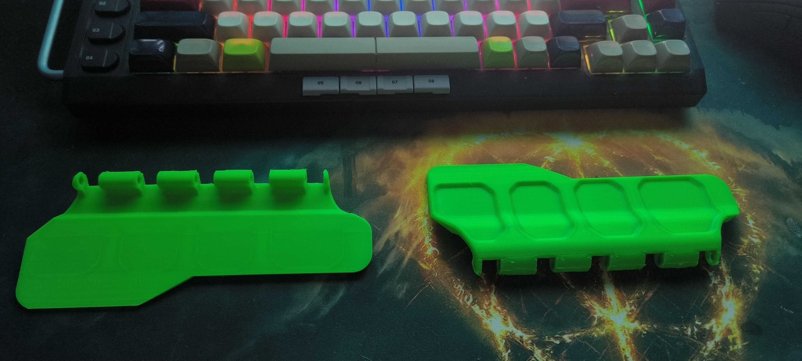

#### 存在的问题

##### 1

`齿条连接件`在使用 **PLA与PETG互为支撑** 的方法时出现了分界面处层间不沾的情况导致打印失败，如下图

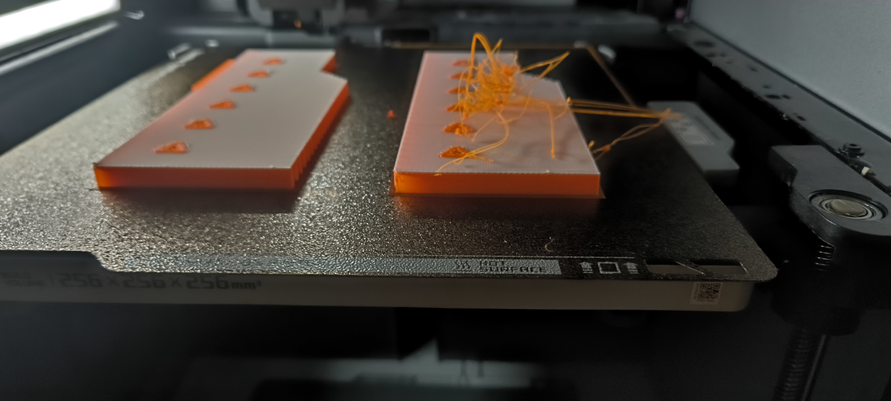

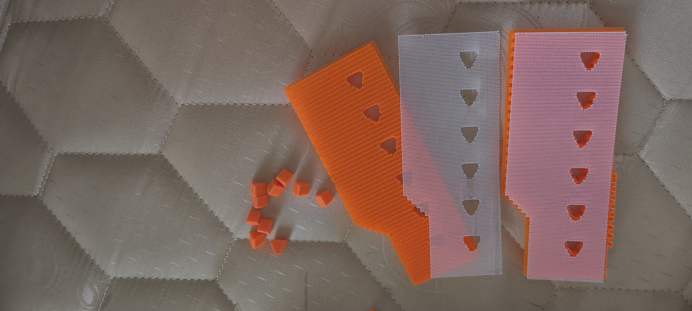

从失败现象来看，PLA可在PETG表面打印，但PETG在PLA表面打印时会出现粘合失败的情况。由于此处支撑为大面积悬垂结构，因此考虑改用切割分件后粘合的方法重新打印。

##### 2

`齿条连接件`分割打印产生翘曲现象，横切影响不大，但纵切由于翘曲程度大无法粘合，如下图

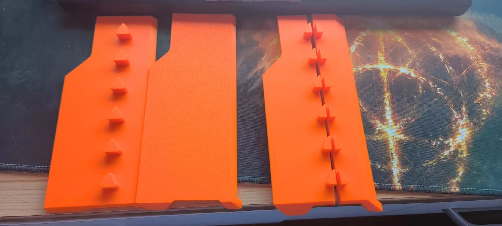

### Model3

> 此文档中的模型需要支撑的较大模型，包含`电池仓本体`

#### 打印结果

将该模型拆分成三部分进行打印

`电池仓本体`：

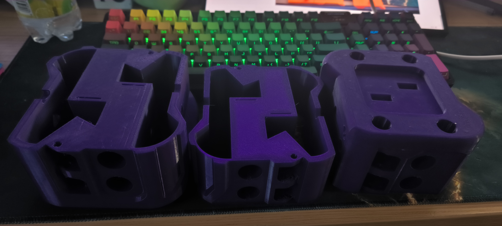

#### 存在的问题

##### 1

由于没有加支撑，悬垂处打印效果不佳

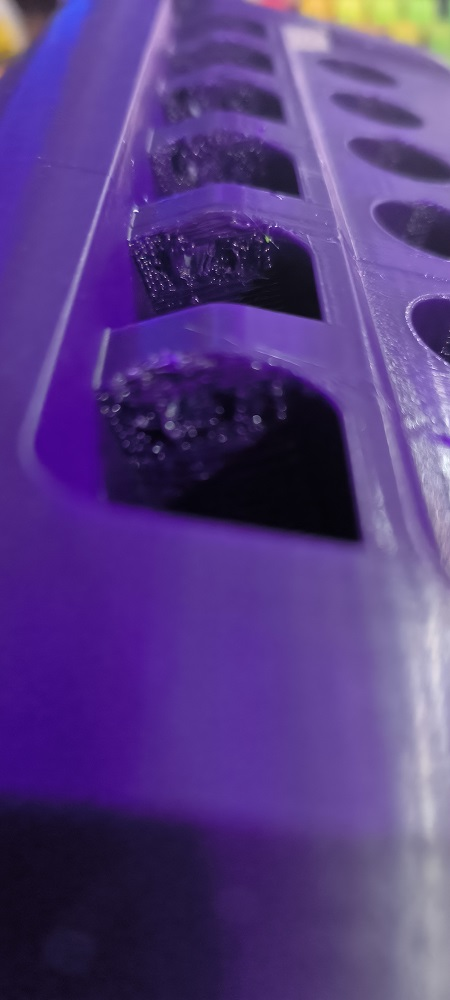

##### 2

未知原因导致`电池仓本体`**下部分**和**中部分**接缝处 *装饰槽* 对不齐

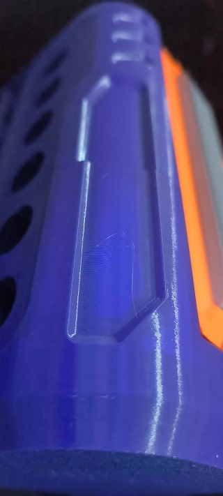

### Model4

> 此部分为`电池仓本体`上的装饰性部件
>
> （但由于中、下部分未对齐的缘故，此部分可能安装不上去）

#### 打印结果

## Ver2

### Model1/2

与Ver1保持一致

### Model3/4

> 此次将电池仓本体上的装饰部分与本体进行多色打印，但效果非常差，因此考虑后续改回分体打印后粘合的方案

#### 打印结果

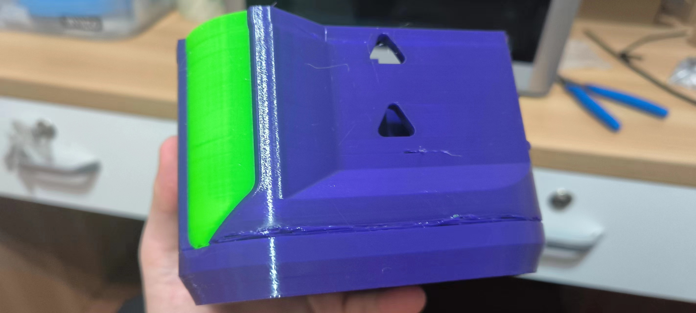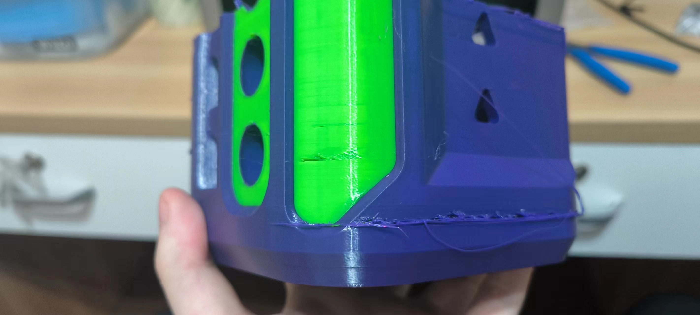

#### 存在的问题

##### 1

换色处侧表面出现裂纹、堆积等缺陷，如上图所示，且有错层现象发生

##### 2

换料非常浪费时间及耗材，大量且频繁的换料导致出料口非常容易堵塞导致打印暂停甚至打印失败，论重量废料与成品大致高达1：2（如下图）。因此如果后续继续沿用一体式多色打印的方案，需要大大减小冲刷体积。

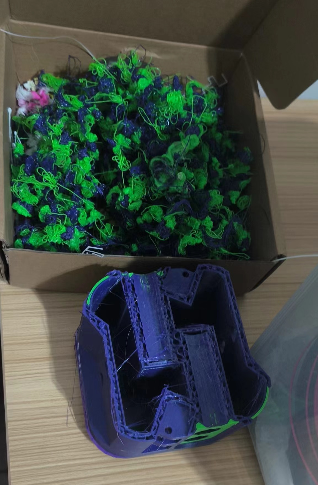

## Ver3

### Model1/2

与Ver1保持一致

### Model3/4

> V2中孔径仍不能满足电池顺畅进入舱体，因此在重新打印前进行孔径测试如下

#### *1 孔径测试实验

> 实际打印过程中，耗材堆积方向、收缩率、冷却速度、打印速度等因素均会影响孔径的实际值，因此孔径标称值与实际值会有差异导致电池插入受限的情况。

18650电池标称直径18mm，实际测得其直径约为18.3mm。以正极侧为电池上部，负极侧为下部。

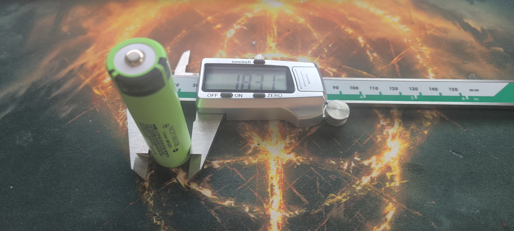

考虑装入后应当容易取出的原则，电池孔位的实际值应当为18.5mm及以上。在满速打印、辅助风扇取默认风速、耗材为PETG的情况下，测定不同标称值孔位的实际表现（以单纯在重力作用下电池是否能顺畅落入孔内为判定标准），结果如下：

##### 1

以**孔轴向**为**耗材堆积方向**打印试件：

通常考虑材料热收缩，PETG打印件上孔的实际直径要比标称值大0.2mm左右，因此首先以18.7mm的标称值打印，结果是电池上部仍不能顺畅进入孔内。经检查是正极侧有环状突起，因此增大至18.9mm，此时电池可顺畅进入孔内。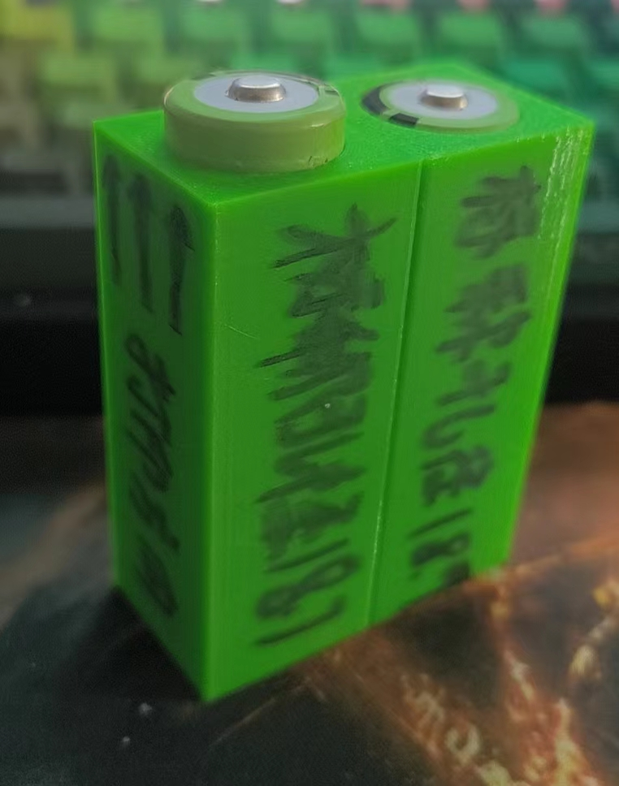

##### 2

以**孔径向**为**耗材堆积方向**打印试件：

在重力作用下，圆形孔顶部悬垂部分会导致打印件**侧孔**内径不规则变小。以0.2mm为梯度打印了三个试样，均存在不同程度的内径变化，导致电池插入受限，甚至将孔径标称值增大至19.1mm仍会在孔内半程出现这种现象。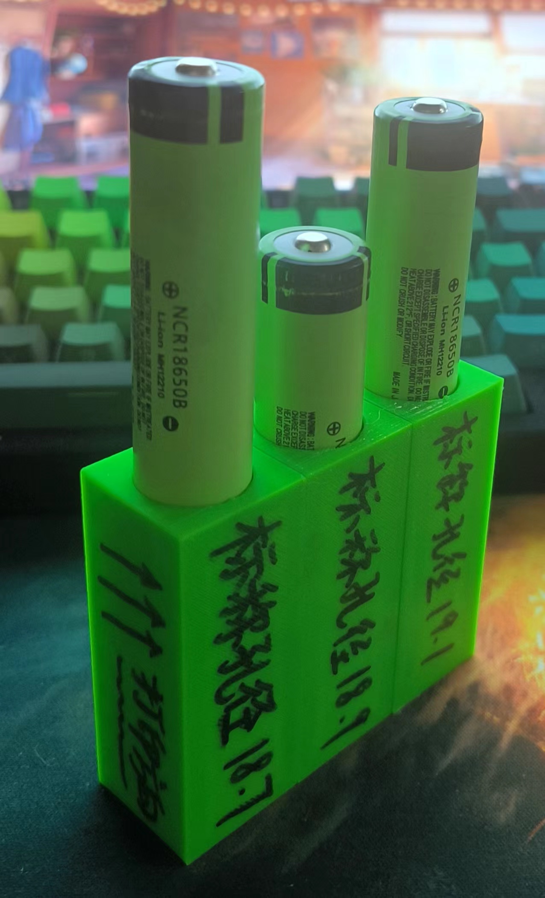

因此考虑从孔形状优化悬垂问题，将孔上部以圆角矩形替代，以减小悬垂面积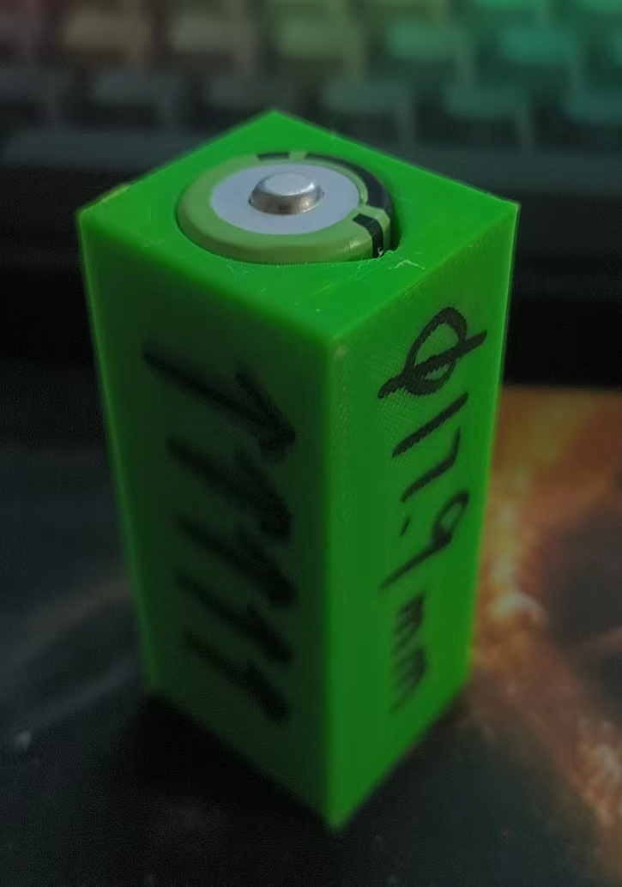

#### *2 其他优化

除孔径之外，此次修改同时针对初版模型存在的以下问题进行了优化：

##### 1.

初版在设计时没有考虑电池仓盖的轴如何安装，这导致轴无法安装进去。本次新增了舱盖轴的安装孔位。

##### 2.

初版没有为电池正极预留接口，本次调整了正、负极板的安装孔位。其中正极板安装孔尺寸更改为可购T2紫铜板尺寸，负极与舱盖轴共用一个安装孔。

##### 3.

初版电池舱盖的轴过细，且没有设计密封装置。本次将轴孔增大为一字孔，便于调整安装，且在电池仓本体上预留了舱盖夹爪的安装孔位（结构参考下图，与AMS舱盖密封夹爪的设计思路相同）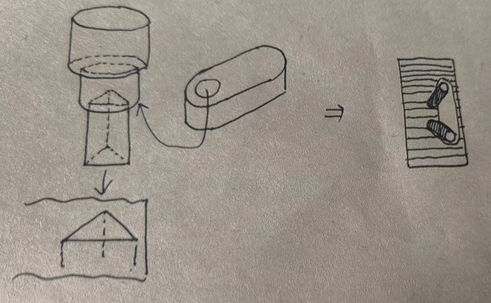

##### 4.

为实现本体多色部分的分体式打印，将原表面异色区域向内切除1mm厚度（在模型内为特征 **拉伸切除** *38* 到*40*，要恢复一体式模型只需将这几个特征压缩）

经过打印测试，虽然装饰件及本体理论上可以完全贴合，但由于材料热收缩等众多因素，装饰件比本体上预留的安装空间略大，因此在尺寸方面有所调整；此外考虑到表面纹理等外观因素，装饰件1进行X方向镜像后打印

#### 打印结果

①本体打印效果

②本体与齿条、齿条连接件粘接后效果

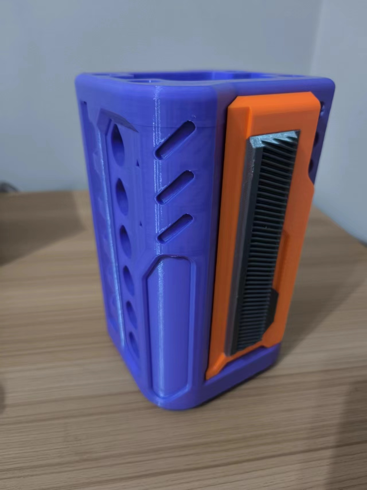

本次在顶部预留了热压螺母孔位用于顶盖安装，效果良好

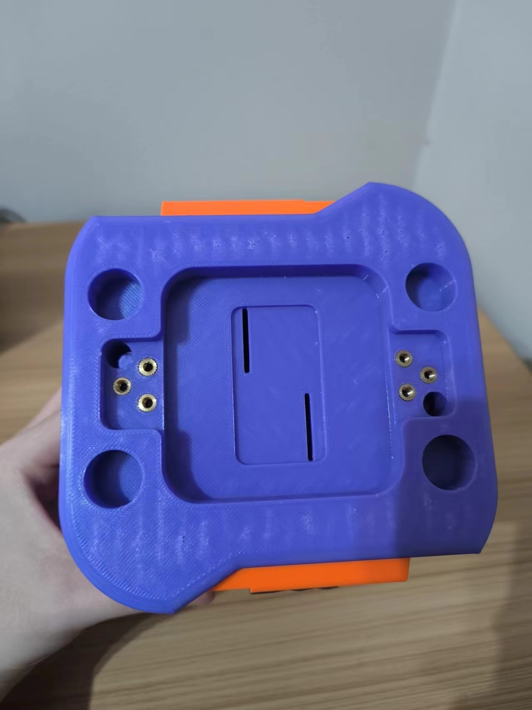

③与剩余部分（装饰件、把手）粘接后效果

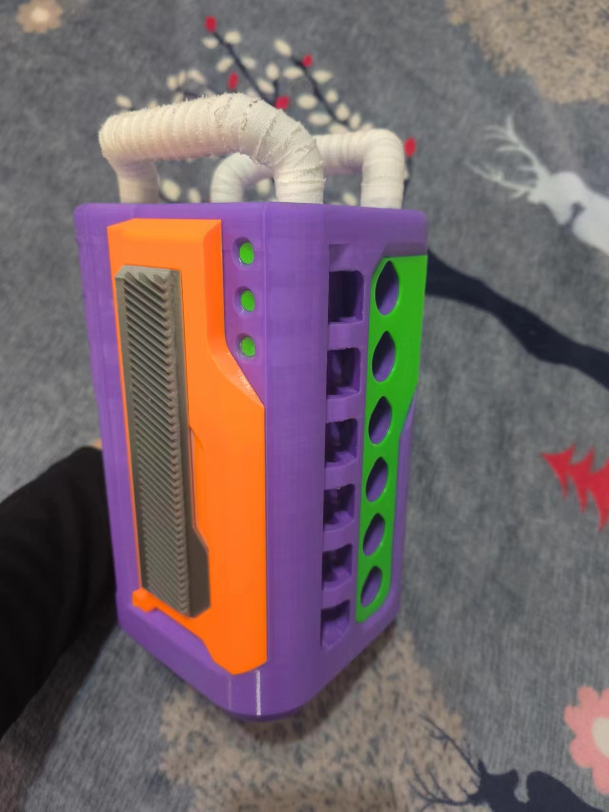

#### 存在的问题

##### 1

正极板的孔位过小，且本体部分与正极板接触面积过大，导致安装非常困难。且铜排装入后不易弯折，应当弯折好之后再装入极板孔。

因此在Ver4进行以下改良：

①修改正极板孔位尺寸

②减少本体与正极板的接触面积

③设计一个铜排弯折工具

##### 2

前文已述（经过打印测试，虽然装饰件及本体理论上可以完全贴合，但由于材料热收缩等众多因素，装饰件比本体上预留的安装空间略大，因此在尺寸方面有所调整；此外考虑到表面纹理等外观因素，装饰件1进行X方向镜像后打印）

##### 3

支撑拆除非常困难（如下图）

且去除支撑后悬垂面效果依然糟糕

## Ver4

### Model1

与Ver1保持一致

### Model2

本次重新设计舱盖，且计划将正极包含于舱盖内

### Model3

#### 模型优化

##### 1

***正极板相关的修改：***

①增大正极板孔位

②原计划在本体电池仓孔底部切除一块与正极板相接触的区域，但由于装饰部分分体打印效果良好，且出于减重考量，直接将本体上各个电池孔打通，减少摩擦。

##### 2

***舱盖压杆相关的修改：***

①除Ver3中提到的旋臂式结构，另外构想了一种更可靠的平移式（如下图）

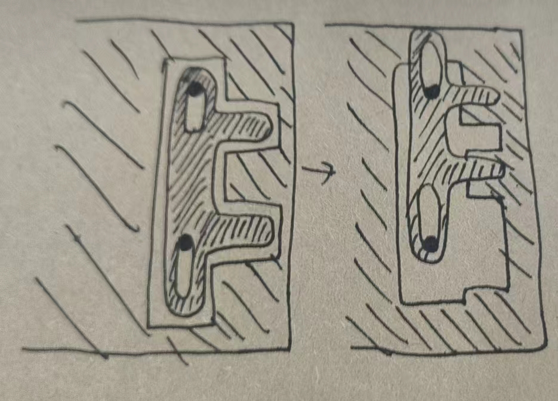

②为方便测试，将本体上此块区域挖空，将本体上的闭锁机构和舱盖上相应的区域改为模块化设计，最终决定使用何种结构（或者也可以直接沿用模块化设计）

##### 3

***顶部相关部分修改***

①因为铜排弯折后厚度不可控，因此增大了为顶面正极铜排预留的槽的深度；

②原顶盖固定螺丝孔设计在两端，这对正极板的压紧效果不好，因此在正极铜排槽中增加了热压螺母孔位。

##### 4

***减重设计***

除前述外，进行了几处减重设计：

①与齿条连接件配合的面：增加开孔的数量。
